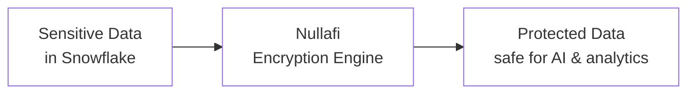
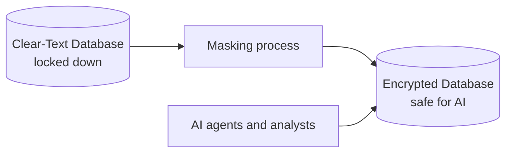
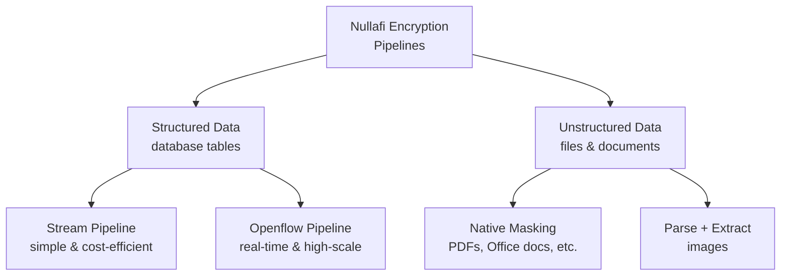

# Securing Sensitive Data in Snowflake with Nullafi

### A high-level overview for stakeholders

---

## The Challenge

Organizations store sensitive personal data — credit card numbers, social security numbers, bank account details, emails — across many Snowflake tables and files. As teams adopt AI (chatbots, document search, analytics agents), this sensitive data risks being exposed to AI models and analysts who shouldn't see it.

**The goal:** automatically encrypt sensitive data so it stays protected, while keeping the rest of the data fully usable for analytics and AI.

---

## The Solution at a Glance

We connect Snowflake directly to **Nullafi**, a data protection service. As data flows through Snowflake, sensitive values are automatically detected and replaced with encrypted tokens. Everything else passes through unchanged.

**Example:**

| Before | After |
|--------|-------|
| `john.doe@email.com` | `NFA_EMAILADDRESS_KWRMTZW2HV0D4Q...` |
| `4532-1234-5678-9010` | `NFA_CREDITCARD_RCMHPGV21932A6Y...` |
| `Buenos Aires` (not sensitive) | `Buenos Aires` (unchanged) |

---

## Keeping Clear-Text and Encrypted Data Apart

A core principle of the design: the original (clear-text) data and the protected (encrypted) data live in **two separate databases**. AI agents and search tools are only ever given access to the **encrypted** database — they have no path to the clear-text data at all.

Think of it as two vaults: sensitive originals sit in a locked vault only the masking process can open, while the AI tools work entirely out of a second vault that contains only protected data.

For the highest level of isolation, the two vaults can live in completely separate Snowflake accounts. In that setup the masking runs in the account that holds the clear-text data, produces the encrypted data there, and then **shares that encrypted data (read-only) to a separate account** where the AI tools live. Snowflake never copies clear-text across accounts and the AI account has no way to reach the originals.

---

## What We Built

We created **four reusable patterns**, each suited to a different type of data and need:

### For Database Tables (Structured Data)

1. **Stream Pipeline** — Lightweight and cost-efficient. Watches tables for new data and encrypts it within a minute. Runs entirely on Snowflake, deployable with scripts.

2. **Openflow Pipeline** — For real-time needs and large scale. Provides a visual interface with advanced monitoring and error handling.

### For Files & Documents (Unstructured Data)

3. **Native Masking** — For PDFs, Word/Excel/PowerPoint, and text files. Nullafi encrypts the sensitive content while keeping the file in its original format. Importantly, **no AI model ever sees the raw sensitive data**.

4. **Parse + Extract** — For images (scanned documents, photos). Extracts the text, then encrypts it. *(Note: this method requires AI to read the image first — see the technical documentation for the security tradeoff.)*

---

## Key Benefits

| Benefit | What it means |
|---------|---------------|
| **Automatic** | Once set up, encryption happens continuously without manual work |
| **Selective** | Only sensitive values are encrypted; useful data stays usable |
| **AI-safe** | Data can be fed to AI agents and search tools without exposing PII |
| **Flexible** | Patterns for tables, documents, and images — pick what fits |
| **Reusable** | Templates with fill-in-the-blank placeholders for any project |

---

## A Proven Example

We built and tested a working pipeline on a sample table of Argentina user data:
- 17 existing records were encrypted in a single batch
- New records are now automatically encrypted within a minute of being added
- Sensitive fields (credit cards, SSNs, emails) are protected; everything else remains readable

This proves the approach works end-to-end and can be replicated across other tables, databases, and file types.

---

## What's Next

The pipelines are documented as **reusable templates**. To apply them to a new project, a data engineer fills in a few configuration values (database names, API key, which data types to protect) and runs the provided scripts.

For technical details, see the [technical documentation](README.md).
