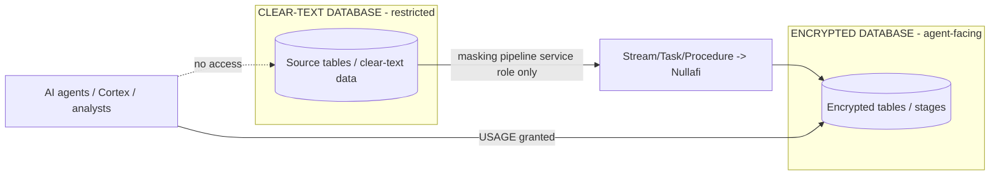
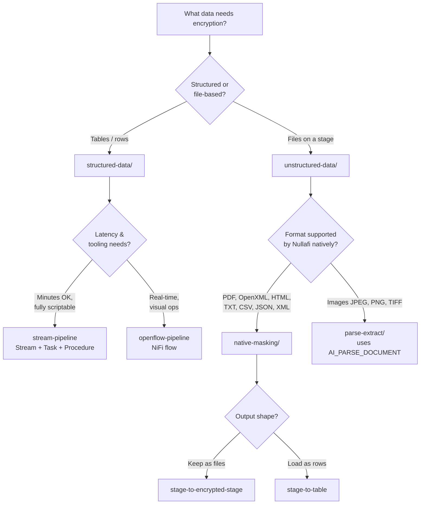
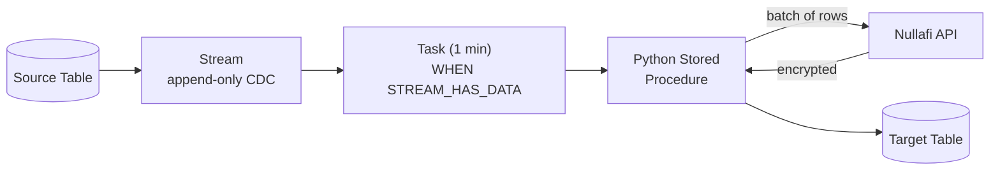
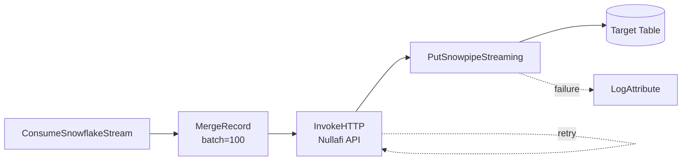
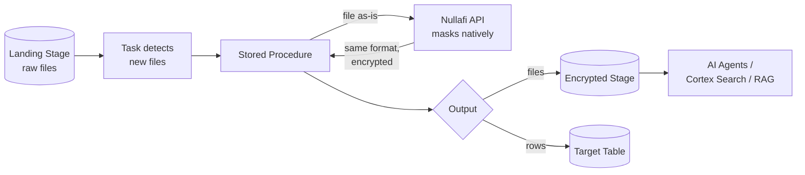
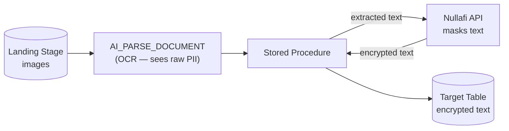

# Nullafi Encryption Pipeline for Snowflake — Technical Documentation

A collection of reusable patterns for encrypting sensitive data (PII) in Snowflake using the [Nullafi Shield API](https://docs.nullafi.com/api/scanning/dynamic-scan/). Covers both **structured** (table-to-table) and **unstructured** (file-based) data, with multiple deployment approaches per category.

> For a high-level summary, see [OVERVIEW.md](OVERVIEW.md).

---

## What Problem This Solves

Sensitive data (credit card numbers, SSNs, IBANs, emails, etc.) needs to be tokenized/encrypted before it is:
- Queried by analysts
- Consumed by AI agents (Cortex Agents, Snowflake Intelligence)
- Sent to LLMs (Cortex Search, RAG pipelines, AI_COMPLETE)

Nullafi's `/api/scan-dynamic` endpoint detects and masks sensitive values while preserving non-sensitive content. These pipelines wire that API into Snowflake-native data flows so encryption happens automatically and continuously.

---

## The Security Boundary: Clear-Text vs Encrypted (separate databases)

The single most important production principle: **clear-text data and encrypted data live in separate databases, and AI agents only ever have access to the encrypted database.** The examples in this repo use a single schema (`POS.PUBLIC`) with names like "landing table" and "encrypted table" for convenience, but in production the boundary is at the **database** level, enforced by access control.



**Rules:**
- The **clear-text database** is locked down. Only the masking pipeline's service role can read it. AI agent roles, Cortex Search, and broad analyst roles get **no grants** on it.
- The **encrypted database** is the only thing exposed to AI agents / Cortex / RAG. Grant those roles `USAGE` here and nowhere near the clear-text data.
- The **masking pipeline is the only bridge** between the two: its procedure reads clear-text and writes encrypted, running with a dedicated role that has read on the source DB and write on the target DB.

**Two levels of separation (choose per compliance need):**

| Level | Mechanism | When |
|-------|-----------|------|
| **Separate databases + RBAC** (primary recommendation) | Two databases in the same account; agent roles get `USAGE` only on the encrypted DB | Most cases — strong, simple boundary |
| **Separate accounts + Secure Data Sharing** (stronger) | Masking runs in the clear-text (producer) account and writes the encrypted DB locally; that encrypted DB is **shared read-only** to a separate agent account | Strict isolation: the agent account has no path to the clear-text account |

> **Important — there is no cross-account write in Snowflake.** Secure Data Sharing is strictly read-only and copies no data. So with separate accounts, the masking pipeline does **not** insert across accounts. It runs entirely in the clear-text (producer) account, writes the encrypted database **locally** in that account, and then that encrypted DB is **shared read-only** to the agent account. The clear-text DB is never shared, so agents cannot reach it. If the encrypted bytes must physically reside in the agent account (not just be queried via the share), transfer them with an external stage handoff (producer `COPY INTO` S3/GCS/Azure → consumer `COPY`/Snowpipe) or database replication.

> Note on "workspaces": Snowflake Workspaces (in Snowsight) are a development convenience, not a data-isolation boundary. The real boundary is **databases + RBAC** (and, for the strongest isolation, **separate accounts** with data sharing). Do not rely on workspaces to separate clear-text from encrypted data.

---

## Decision Tree



---

## Repository Structure

```
nullafi-encryption-pipeline/
├── README.md                          ← This file (technical)
├── OVERVIEW.md                        ← High-level presentation doc
│
├── structured-data/                   ← Table-to-table encryption
│   ├── stream-pipeline/               ← Stream + Task + Python procedure (fully scriptable)
│   │   ├── users-argentina-example/   ← Working, deployed, tested example
│   │   └── production-template/       ← Multi-table, multi-DB, PK/FK aware template
│   └── openflow-pipeline/             ← Managed NiFi flow (real-time, visual)
│       ├── flow-definition/           ← Importable NiFi flow JSON
│       └── snowflake-setup/           ← SQL prerequisites
│
└── unstructured-data/                 ← File-based encryption
    ├── native-masking/                ← Nullafi masks natively (no AI sees PII)
    │   ├── stage-to-encrypted-stage/  ← File → encrypted file (same format)
    │   └── stage-to-table/            ← File → encrypted rows
    └── parse-extract/                 ← Images → AI_PARSE_DOCUMENT → mask text

└── etl-ingestion/                     ← Docs: external ETL (Airbyte, Informatica) + masking patterns
```

> **ETL ingestion (Airbyte, Informatica, etc.):** documented in [etl-ingestion/](etl-ingestion/README.md). External ETL tools handle ingestion; masking is reused from `structured-data/stream-pipeline` (Pattern A) or done mid-flight (Pattern B, as `openflow-pipeline` already shows). Note: Openflow IS Apache NiFi — an open-source ETL engine we already built on.

---

## Approach 1: Structured Data — Stream Pipeline

**Use when:** table-to-table encryption, fully scriptable deployment, cost-efficient, ~1 minute latency acceptable.



**Mechanics:**
- An **append-only stream** captures new rows as they are inserted
- A **task** checks every minute and fires only when the stream has data
- A **Python stored procedure** reads rows in batches (default 100), sends all fields to the Nullafi API, and inserts encrypted results
- An **External Access Integration** + **Secret** secure the API connection

**Key design points:**
- Sends ALL fields to the API; Nullafi detects which values match the configured `obfuscatedDataTypes` and masks only those
- `BATCH_SIZE` constant controls rows per API call
- Backfill mode re-encrypts existing rows; incremental mode processes only stream changes
- For multiple tables with FK constraints: tables created parent-first, truncated child-first, backfilled parent-first, tasks chained via `AFTER` (DAG)

**Status:** The `users-argentina-example` is deployed and tested in the `POS.PUBLIC` schema.

---

## Approach 2: Structured Data — Openflow Pipeline

**Use when:** real-time latency, many tables, rich operational tooling (retries, back-pressure, provenance) needed.



**Mechanics:**
- A managed NiFi flow (deployed via Openflow) reads the stream, batches records, calls the API, and writes results
- Built-in retry loops, back-pressure, and dead-letter routing
- Configured through a Parameter Context (table names, API key, data types, etc.)

**Important:** Openflow flows are built in the NiFi UI canvas. The provided `flow-definition/nullafi_encryption_flow.json` represents the flow structure and can be imported, but the initial creation/editing is visual. Snowflake setup (roles, warehouse, target DB) is fully scriptable.

---

## Approach 3: Unstructured Data — Native Masking

**Use when:** files in formats Nullafi supports (PDF, OpenXML, HTML, TXT, CSV, JSON, XML).



**Core principle — Encrypt Before Ingest:** the API is called at a transient landing stage before data reaches its queryable/consumable destination. Raw PII never lands in a final Snowflake object.

**Two output options:**
- `stage-to-encrypted-stage`: file in → encrypted file out, same format (PDF stays PDF, DOCX stays DOCX) — ideal for AI agent consumption
- `stage-to-table`: file content → encrypted rows in a table — ideal for CSV/JSON/XML

**No AI model sees the raw PII** — Nullafi masks these formats deterministically.

---

## Approach 4: Unstructured Data — Parse + Extract

**Use when:** formats Nullafi does NOT support natively (images: JPEG, PNG, TIFF).



**⚠️ Security caveat:** `AI_PARSE_DOCUMENT` uses AI models to extract content, so raw PII is processed by a model during OCR — before masking. This happens inside Snowflake's Cortex boundary (not an external LLM, not used for training), but if your policy is "no AI model may ever see raw PII," this approach does not satisfy it. For images this is unavoidable — something must OCR raw pixels to find PII. Output is encrypted text, not the original image format. See [parse-extract/README.md](unstructured-data/parse-extract/README.md).

---

## Build & Test Status

| Pipeline | Built | Tested live (POS.PUBLIC) | Docs |
|----------|-------|--------------------------|------|
| structured / stream-pipeline | Yes | Yes (users-argentina) | Yes |
| structured / openflow-pipeline | Flow JSON + SQL setup | UI import required (not auto-deployable) | Yes |
| unstructured / native-masking / stage-to-encrypted-stage | Yes | Yes (text + PDF + XLSX masked; images skipped; incremental) | Yes |
| unstructured / native-masking / stage-to-table | Yes | Yes (text files → masked rows; batch + incremental) | Yes |
| unstructured / parse-extract | Yes | Yes (PNG → OCR → masked text in table) | Yes |

Test files for the unstructured pipelines are generated from `USERS_ARGENTINA` by the `GENERATE_TEST_FILES` procedure (CSV, JSON, XML, TXT, HTML, XLSX, PDF, PNG). Key as-tested findings (SSE stages required, images not natively maskable, context-sensitive detection) are documented in [unstructured-data/WORKFLOW-DESIGN.md](unstructured-data/WORKFLOW-DESIGN.md).

---

## Common Building Blocks

All approaches share these Snowflake objects:

| Object | Purpose |
|--------|---------|
| **Secret** (`GENERIC_STRING`) | Stores the Nullafi API key securely |
| **Network Rule** (`EGRESS`) | Allows outbound HTTPS to the Nullafi host |
| **External Access Integration** | Grants procedures permission to call the API |
| **Stream** / **Stage** | Source of changes (rows or files) |
| **Task** | Event-driven trigger (`WHEN SYSTEM$STREAM_HAS_DATA`) |
| **Python Stored Procedure** | Reads data, calls API, writes encrypted output |

### Nullafi API Contract

```
POST https://<host>/api/scan-dynamic
  ?namespace=<app>
  &obfuscatedDataTypes=CREDIT_CARD,US_SSN,IBAN,EMAIL_ADDRESS
  &maskFormats=CYPHER,CYPHER,CYPHER,CYPHER
  &storeOriginalValues=true
Authorization: Bearer <api-key>
Content-Type: application/json   (or the file's content type)

Response: same format as the request, with matching values masked.
```

---

## Comparison Matrix

| | Stream Pipeline | Openflow | Native Masking | Parse + Extract |
|---|---|---|---|---|
| **Data** | Tables | Tables | Files (supported) | Files (images) |
| **Latency** | ~1 min | Real-time | Per-file | Per-file |
| **Fully scriptable** | Yes | No (UI for flow) | Yes | Yes |
| **AI sees raw PII** | No | No | No | **Yes (OCR)** |
| **Cost model** | On-demand | Always-on | On-demand | On-demand + AI |
| **Best for** | Most table cases | High-scale/real-time | Documents for AI | Images only |

---

## Deployment Quick Reference

Each pipeline folder contains:
- `scripts-by-step/` — numbered SQL files (0, 1, 2...) to run in order
- `single-script/` — everything combined in one deployable file
- Placeholders in `{{DOUBLE_BRACES}}` to fill in before running

General order: Secret → Network Rule + Integration → Target objects → Stored Procedure → Backfill → Stream/Stage → Task.

---

## Limitations & Notes

- **SSL:** procedures use `verify=False` for self-signed certs. Remove for production CA-signed certificates.
- **Streams only capture new rows** — backfill runs before stream creation.
- **Append-only streams** capture INSERTs only. For UPDATE/DELETE handling, remove `APPEND_ONLY` and handle `METADATA$ACTION`.
- **Parse + extract** exposes PII to an AI model during OCR — review against your compliance policy.
