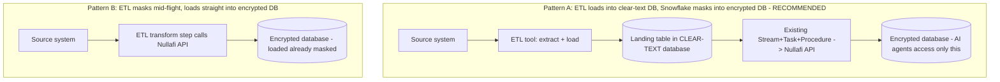

# ETL Ingestion into Snowflake (with Nullafi Masking)

> **Status: documentation only.** Unlike the in-Snowflake pipelines in this repo, third-party ETL tools (Airbyte, Informatica) run *outside* Snowflake and require standing up that tool to test end to end. This folder documents the options, the recommended patterns, and how they integrate with the masking pipelines we already built and tested. It does not deploy an external ETL tool.

---

## ETL vs ELT (and where masking fits)

Classic **ETL** = Extract → Transform → Load. Modern **ELT** (which Snowflake favors) = Extract → Load → Transform, doing the transform inside Snowflake after loading.

For PII masking via Nullafi, the only question that matters is **where the masking happens**:

> The "landing table" lives in the **clear-text database** (locked down, only the masking role reads it). The masking pipeline writes results into the separate **encrypted database**, which is the only thing AI agents/Cortex can access. See the security boundary section in the [root README](../README.md#the-security-boundary-clear-text-vs-encrypted-separate-databases). With Pattern B the ETL tool masks before loading, so clear-text never lands in Snowflake at all.

| | Pattern A (mask in Snowflake) | Pattern B (mask in the ETL tool) |
|---|---|---|
| Effort | Low — reuses pipelines we already built and tested | Higher — build/maintain the Nullafi call inside the ETL tool |
| Where raw PII lands | Transiently in the clear-text database's landing area (locked down) | Never lands in Snowflake unmasked |
| Reuse | Full (our `structured-data/stream-pipeline` does the masking) | None — ETL-tool-specific |
| Best when | You want simplicity and to reuse existing work | Raw PII must never touch Snowflake, even transiently |

**Recommendation:** Pattern A for most cases — let the ETL tool do what it is good at (moving data) and let our existing Snowflake-native masking pipeline encrypt it. Use Pattern B only if compliance forbids raw PII landing in Snowflake at all.

---

## We already have an ETL tool: Openflow (Apache NiFi)

`structured-data/openflow-pipeline` is built on **Apache NiFi**, an open-source data-integration/ETL engine. It already demonstrates **Pattern B** — an `InvokeHTTP` processor calls Nullafi mid-flight before `PutSnowpipeStreaming` loads the data. If you want open-source ETL with mid-flight masking, that is the answer and it is already documented.

---

## Option 1: Airbyte (most popular free / open-source ETL)

Snowflake's ecosystem docs explicitly label Airbyte "open source integration" with a native, Snowflake-Ready-validated Snowflake destination connector. See [airbyte.md](airbyte.md).

- **Cost**: free (self-hosted OSS) or paid Cloud
- **Best pattern**: A — Airbyte loads raw data into a Snowflake landing table, our existing pipeline masks it
- **Auth to Snowflake**: key-pair (recommended for the service user)

## Option 2: Informatica (enterprise ETL)

Snowflake lists Informatica Cloud (IDMC) as a certified, Snowflake-Ready-validated ETL partner with a native connector, available via Partner Connect. See [informatica.md](informatica.md).

- **Cost**: enterprise / paid
- **Makes sense when**: Informatica is already in your stack with existing skills/licenses; enterprise governance, lineage, and complex/legacy sources (SAP, mainframe) are needed
- **Auth to Snowflake**: OAuth, key-pair, or PAT
- **Both patterns possible**; Pattern A is still simplest (reuse our masking)

## Other notable open-source options

| Tool | Type | Note |
|------|------|------|
| dlt | Python library | Code-first EL; native Snowflake destination |
| Kafka Connect | Streaming | Native Snowflake Kafka connector (see also Snowpipe Streaming) |
| Pentaho Data Integration (PDI) | GUI ETL | Community edition available |
| Meltano / Singer | OSS EL | Tap/target ecosystem |

---

## How this maps to the rest of the repo

| Need | Use |
|------|-----|
| Move data from external sources into Snowflake, then mask | An ETL tool (Airbyte/Informatica) for ingestion + `structured-data/stream-pipeline` for masking (Pattern A) |
| Mask mid-flight with open-source ETL | `structured-data/openflow-pipeline` (NiFi, Pattern B) |
| Table-to-table masking already in Snowflake | `structured-data/stream-pipeline` |
| File-based masking | `unstructured-data/` |

---

## Why no live test here

Every other pipeline in this repo runs inside Snowflake and was testable purely with SQL. Airbyte and Informatica run outside Snowflake (a self-hosted container / a SaaS org + Secure Agent), so an end-to-end test requires provisioning that external tool. What is fully reusable and already tested is the **Snowflake side** (landing + masking via `structured-data/stream-pipeline`). To validate Pattern A concretely, point any ETL tool's Snowflake destination at a landing table, then run the existing masking pipeline against it.
