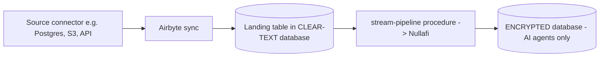

# Airbyte → Snowflake (with Nullafi Masking)

Airbyte is the most popular free, open-source ETL/EL tool. Snowflake's ecosystem documentation lists it as "open source integration" with a native, Snowflake-Ready-validated **Snowflake destination connector**.

> Reference only. Airbyte runs outside Snowflake (self-hosted OSS via Docker/abctl, or Airbyte Cloud). This doc describes how to wire it up; it is not deployed here.

---

## Recommended pattern: A (Airbyte loads into clear-text DB, Snowflake masks into encrypted DB)



Airbyte loads into a landing table in the **clear-text database** (locked down). The masking is handled by the already-tested `structured-data/stream-pipeline`, which writes masked rows into the separate **encrypted database** — the only database AI agents are granted access to.

## Setup outline

1. **Snowflake side** (run once):
   - Create a destination database/schema and a landing table (or let Airbyte create it)
   - Create a service user for Airbyte with key-pair auth:
     ```sql
     CREATE USER AIRBYTE_SVC TYPE = SERVICE;
     ALTER USER AIRBYTE_SVC SET RSA_PUBLIC_KEY = '<public key>';
     CREATE ROLE AIRBYTE_ROLE;
     GRANT ROLE AIRBYTE_ROLE TO USER AIRBYTE_SVC;
     GRANT USAGE ON WAREHOUSE <wh> TO ROLE AIRBYTE_ROLE;
     GRANT USAGE ON DATABASE <db> TO ROLE AIRBYTE_ROLE;
     GRANT USAGE, CREATE TABLE ON SCHEMA <db>.<schema> TO ROLE AIRBYTE_ROLE;
     ```
2. **Airbyte side**:
   - Configure a Source connector (Postgres, MySQL, S3, an API, etc.)
   - Configure the **Snowflake destination**: account, warehouse, database, schema, role `AIRBYTE_ROLE`, user `AIRBYTE_SVC`, key-pair authentication
   - Set a sync schedule (e.g., hourly) and run
3. **Masking** (reuse this repo):
   - Deploy `structured-data/stream-pipeline/production-template` against the Airbyte landing table
   - The stream + task pick up newly-synced rows and write masked rows to the encrypted table

## Authentication

Per Snowflake docs, Airbyte (listed as "EL") connects with **key-pair authentication** for the service user. Generate an RSA key pair, assign the public key to the user, and provide the private key in the Airbyte destination config.

## Pattern B (mask inside Airbyte) — possible but heavier

Airbyte focuses on EL; transformations are typically pushed to dbt/SQL after load. To mask mid-flight you would add a custom transformation or a custom connector that calls the Nullafi API — more effort than Pattern A and not the tool's sweet spot. Prefer Pattern A, or use Openflow (NiFi) if you specifically need mid-flight masking with an open-source tool.

## When to choose Airbyte

- You want free/open-source with a large connector catalog
- You are comfortable self-hosting (or use Airbyte Cloud)
- Pattern A (mask in Snowflake) fits your compliance posture
