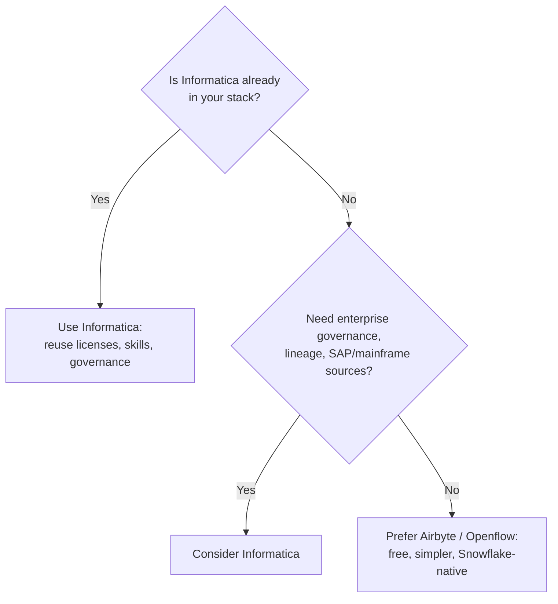

# Informatica → Snowflake (with Nullafi Masking)

Informatica is an enterprise ETL/data-management platform. Snowflake's ecosystem documentation lists **Informatica Cloud (Intelligent Data Management Cloud / IDMC)** as a certified, Snowflake-Ready-validated partner with a native connector, available via Snowflake Partner Connect.

> Reference only. Informatica runs outside Snowflake (a SaaS org plus a Secure Agent you host). This doc describes the approach and when it makes sense; it is not deployed here.

---

## Is it possible? Yes.

- Native **Cloud Connector for Snowflake** (in the Informatica Cloud UI or the Informatica Marketplace)
- A **Secure Agent** runs the data movement
- For push-down optimization, the Snowflake ODBC driver is used; otherwise no extra Snowflake requirements
- Authentication to Snowflake: **OAuth, key-pair, or PAT** (per Snowflake's partner authentication matrix; Informatica is listed as "ETL")

## Does it make sense?

| Choose Informatica when | Look elsewhere when |
|---|---|
| It is already licensed and your team knows it | Greenfield / cost-sensitive |
| You need enterprise lineage, governance, complex mappings | You want free + open-source |
| Legacy/enterprise sources (SAP, mainframe, on-prem) | Simple ingestion into Snowflake |

It is **enterprise/paid** — justified by an existing investment, not as a new greenfield choice purely to load Snowflake.

## Recommended pattern: A (Informatica loads into clear-text DB, Snowflake masks into encrypted DB)

Informatica mappings ingest source data into a landing table in the **clear-text database**; the already-tested `structured-data/stream-pipeline` masks it via Nullafi and writes to the separate **encrypted database** that AI agents are granted access to. This keeps the masking logic in one reusable place regardless of which ETL tool feeds the clear-text landing table.

## Pattern B (mask inside Informatica)

Informatica can call a REST endpoint mid-mapping, so a Nullafi `/api/scan-dynamic` call could be embedded in a mapping/transformation so data is masked before it loads. This avoids raw PII landing in Snowflake at all, at the cost of building and maintaining that logic in Informatica. Use only if compliance requires it.

## Setup outline (Pattern A)

1. Snowflake: create a service user (key-pair or OAuth), role, warehouse, landing database/schema/table with the appropriate grants
2. Informatica: configure the Snowflake connector (account, warehouse, database, schema, role, auth), build a mapping from the source to the landing table, schedule it
3. Deploy `structured-data/stream-pipeline/production-template` against the landing table to mask newly-loaded rows
