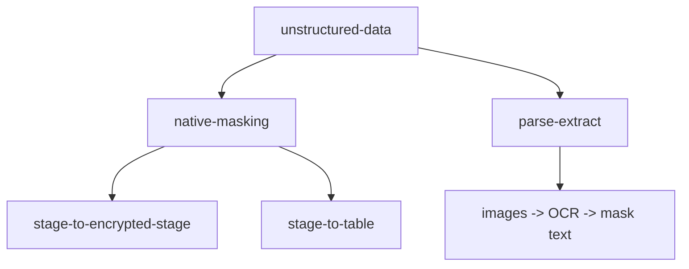

# Unstructured Data Encryption — Workflow Design

> This is the design reference for the unstructured-data pipelines. It was written from the implementation plan and **reconciled with the as-built, as-tested system**. Where testing changed the design, this document reflects what was actually built.

---

## Goal

Encrypt PII inside files before they are ingested into a consumable Snowflake object (queryable table or AI-readable stage), using the Nullafi `/api/scan-dynamic` endpoint.

## Three pipelines

| Pipeline | Input | Output | Nullafi handling |
|----------|-------|--------|------------------|
| native-masking / stage-to-encrypted-stage | PDF, OpenXML, HTML, TXT, CSV, JSON, XML | Encrypted file, same format | Native (no AI sees PII) |
| native-masking / stage-to-table | CSV, JSON, XML, TXT, HTML | Masked content as table rows | Native (no AI sees PII) |
| parse-extract | Images (PNG, JPG, TIFF) | Masked text in a table | OCR via AI_PARSE_DOCUMENT (AI sees raw PII) |

## Common pattern

All three follow: **landing stage → stream (directory table) → task → Python procedure → Nullafi API → target (stage or table)**. Procedures support `all` (batch) and `incremental` (stream-driven) modes. They reuse the existing `NULLAFI_API_ACCESS` integration and `NULLAFI_API_KEY_SECRET`.

> **Production database separation:** the landing stage sits in a locked-down clear-text database; the encrypted target (stage or table) sits in a separate encrypted database that is the only one AI agents/Cortex can access. The `POS.PUBLIC` test environment collapses this into one schema for convenience. Stricter setups put the two in separate accounts and share the encrypted database read-only (no cross-account write — masking runs producer-side). See the [root README](../README.md#the-security-boundary-clear-text-vs-encrypted-separate-databases).

## Decisions reconciled with testing

These are findings from live testing that shaped the final implementation:

1. **Stages must use `SNOWFLAKE_SSE`.** Client-side encryption (the default) breaks `PARSE_DOCUMENT` and AI consumption. All landing/target stages are created with `ENCRYPTION = (TYPE = 'SNOWFLAKE_SSE')`.

2. **Native masking does not support images.** A PNG sent to `/api/scan-dynamic` returned an empty result. The stage-to-encrypted-stage procedure now skips image extensions and reports them as "use parse-extract". This is why parse-extract exists as a separate pipeline.

3. **Binary native masking is real.** PDF and XLSX were masked natively (verified by re-parsing the encrypted PDF — it contained `NFA_` tokens). No text extraction/reconstruction needed for these.

4. **Parameterized INSERT required for tables.** `save_as_table` failed against a table with a `DEFAULT` column. The table-loading procedures use explicit `INSERT ... VALUES (?, ?, ?)` with bind params.

5. **Detection is context-sensitive.** Nullafi's `CREDIT_CARD` detection masked a card in CSV but missed one in a free-text TXT line. Detection accuracy is Nullafi engine behavior; tune `obfuscatedDataTypes`/formats per data.

6. **parse-extract exposes raw PII to an AI model** during OCR (inside Cortex). Documented as a caveat; acceptable only if Cortex-internal AI processing of raw PII fits the compliance policy.

## Test harness

`GENERATE_TEST_FILES(stage)` reads `POS.PUBLIC.USERS_ARGENTINA` and produces CSV, JSON, XML, TXT, HTML (stdlib), XLSX (openpyxl), PDF (reportlab), and PNG (Pillow) files with real PII, uploaded to the landing stage. `ADD_ONE_TEST_FILE(stage, name)` adds a single file to exercise incremental/stream paths.

## Deployed objects (POS.PUBLIC) — test environment

- Stages: `NULLAFI_LANDING_STAGE`, `NULLAFI_ENCRYPTED_STAGE` (both SSE)
- Procedures: `NULLAFI_ENCRYPT_STAGE_FILES`, `NULLAFI_ENCRYPT_FILES_TO_TABLE`, `NULLAFI_PARSE_EXTRACT_IMAGES`, `GENERATE_TEST_FILES`, `ADD_ONE_TEST_FILE`, `READ_STAGE_FILE_TEXT`
- Tables: `NULLAFI_MASKED_FILES`, `NULLAFI_IMAGE_TEXT_MASKED`
- Streams: `NULLAFI_LANDING_STREAM`, `NULLAFI_LANDING_STREAM_TBL`, `NULLAFI_LANDING_STREAM_IMG`
- Tasks: `NULLAFI_ENCRYPT_STAGE_TASK`, `NULLAFI_FILES_TO_TABLE_TASK`, `NULLAFI_PARSE_EXTRACT_TASK`
