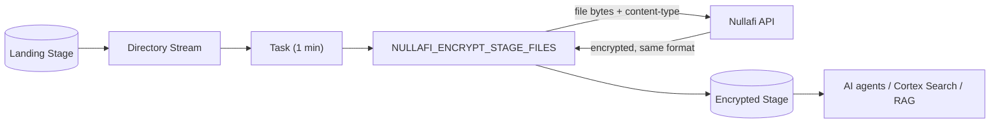

# Native Masking: Stage to Encrypted Stage

Mask PII inside files and write the encrypted result back as a file in the **same format**. A PDF stays a valid PDF, an XLSX stays a valid XLSX — but sensitive values inside are replaced with Nullafi tokens.

---

## Use Case

You have files (documents, spreadsheets, exports) containing PII that will be consumed by AI agents, Cortex Search, RAG pipelines, or shared with users. You need the sensitive content encrypted but the files must remain usable in their original format.

## When To Use

- Files must stay as files (not flattened into table rows)
- Formats are ones Nullafi masks natively: CSV, JSON, XML, TXT, HTML, PDF, XLSX, DOCX, PPTX
- You want AI-safe documents that Cortex/agents can still parse

## When NOT To Use

- **Images** (PNG, JPG, TIFF) — not natively maskable; use the `parse-extract` pipeline
- You want the data as queryable rows — use the `stage-to-table` pipeline

---

## Architecture

## How It Works

1. Raw files land in the landing stage (directory table enabled)
2. A directory-table **stream** records new files
3. A **task** fires every minute when the stream has data
4. The **procedure**:
   - Lists new files (incremental) or all files (batch)
   - Skips image formats (routes them mentally to parse-extract)
   - Downloads each file, POSTs the bytes to `/api/scan-dynamic` with the right `Content-Type`
   - Writes the encrypted response (same format) to the encrypted stage, prefixed `enc_`

## Components

| Object | Name (example) |
|--------|----------------|
| Landing stage | `POS.PUBLIC.NULLAFI_LANDING_STAGE` |
| Encrypted stage | `POS.PUBLIC.NULLAFI_ENCRYPTED_STAGE` |
| Procedure | `POS.PUBLIC.NULLAFI_ENCRYPT_STAGE_FILES(mode, source, target, stream)` |
| Stream | `POS.PUBLIC.NULLAFI_LANDING_STREAM` |
| Task | `POS.PUBLIC.NULLAFI_ENCRYPT_STAGE_TASK` |
| Reused infra | `NULLAFI_API_ACCESS`, `NULLAFI_API_KEY_SECRET` |

## Folders

- `users-argentina-example/` — concrete, deployed, and tested against `POS.PUBLIC`
- `production-template/` — placeholder version (includes secret + integration creation)

## Key Requirements & Findings (from live testing)

- **Stages MUST use `SNOWFLAKE_SSE`** (server-side encryption). The default client-side encryption breaks `PARSE_DOCUMENT` ("Input files from stages with Client Side Encryption is not supported") and downstream AI consumption.
- **Native masking confirmed for text + binary**: CSV/JSON/XML/TXT/HTML masked correctly; PDF and XLSX masked natively (verified by re-parsing the encrypted PDF — it contained `NFA_` tokens for emails, cards, SSNs).
- **Images are not maskable here**: a PNG returned an empty result, so the procedure now skips image extensions and reports them as "use parse-extract".
- **Detection is context-sensitive**: Nullafi's `CREDIT_CARD` detection masked a card in structured CSV but, in one free-text TXT case, left an adjacent card unmasked. Detection accuracy is Nullafi engine behavior, not a pipeline issue — tune `obfuscatedDataTypes` / formats to your data.

## Test Results (users-argentina-example)

| File | Result |
|------|--------|
| users_sample.csv | Masked (EMAIL, CC_NUMBER, US_SSN, IBAN -> NFA_ tokens) |
| users_sample.json/xml/txt/html | Masked |
| users_sample.pdf | Masked (verified via PARSE_DOCUMENT) |
| users_sample.xlsx | Masked (OpenXML, size grew with tokens) |
| users_sample.png | Skipped (unsupported -> parse-extract) |
| Incremental (new_customer.txt via stream) | Masked within the task cycle |

## Placeholders (production-template)

`{{SECRET_*}}`, `{{NETWORK_RULE_*}}`, `{{NULLAFI_HOSTNAME}}`, `{{INTEGRATION_NAME}}`, `{{LANDING_*}}`, `{{ENCRYPTED_*}}`, `{{PROCEDURE_*}}`, `{{STREAM_*}}`, `{{TASK_*}}`, `{{WAREHOUSE}}`, `{{SCHEDULE}}`, `{{NULLAFI_NAMESPACE}}`, `{{DATA_TYPES}}`, `{{MASK_FORMATS}}`.
