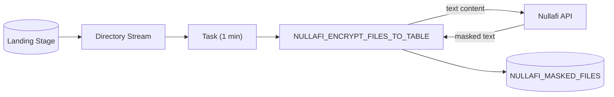

# Native Masking: Stage to Table

Mask PII inside **text-based files** and load the masked content into a queryable Snowflake table (one row per file).

---

## Use Case

You have text-based files (CSV, JSON, XML, TXT, HTML) on a stage and you want their content — with PII masked — available as queryable rows in a table, rather than kept as files.

## When To Use

- Source files are text formats: CSV, JSON, XML, TXT, HTML
- You want masked content queryable via SQL (e.g., `TRY_PARSE_JSON`, `ILIKE`, joins)
- You are building a masked, searchable content table

## When NOT To Use

- You need to keep files in their original format (PDF, DOCX, XLSX) → use `stage-to-encrypted-stage`
- Source is images → use `parse-extract`

---

## Architecture

## How It Works

1. Text files land in the landing stage
2. A directory-table stream records new files; a task fires when it has data
3. The procedure reads each text file, POSTs its content to `/api/scan-dynamic`, and inserts the masked text into the target table with `FILE_NAME`, `FILE_FORMAT`, `MASKED_CONTENT`, `LOADED_AT`
4. Non-text files (PDF, XLSX, images) are skipped

## Components

| Object | Name (example) |
|--------|----------------|
| Landing stage | `POS.PUBLIC.NULLAFI_LANDING_STAGE` |
| Target table | `POS.PUBLIC.NULLAFI_MASKED_FILES` |
| Procedure | `POS.PUBLIC.NULLAFI_ENCRYPT_FILES_TO_TABLE(mode, source, target_table, stream)` |
| Stream | `POS.PUBLIC.NULLAFI_LANDING_STREAM_TBL` |
| Task | `POS.PUBLIC.NULLAFI_FILES_TO_TABLE_TASK` |

## Folders

- `users-argentina-example/` — deployed and tested against `POS.PUBLIC`
- `production-template/` — placeholder version (includes secret + integration)

## Key Findings (from live testing)

- **Insert must be explicit/parameterized**: `save_as_table` failed against a table with a `DEFAULT` column ("Insert value list does not match column list expecting 4 but got 3"). The procedure uses `INSERT INTO ... (cols) VALUES (?, ?, ?)` with bind params so the `LOADED_AT` default applies.
- **Scoped to text formats**: binary (PDF/XLSX) and images are skipped here by design; the masked content of text files is stored as queryable text.
- Stage uses `SNOWFLAKE_SSE` (consistent with the other unstructured pipelines).

## Test Results (users-argentina-example)

| File | Result |
|------|--------|
| users_sample.csv / json / xml / txt / html | Loaded, `NFA_` tokens present in MASKED_CONTENT |
| new_customer.txt (batch) | Loaded |
| tbl_incremental_test.txt (via stream) | Loaded incrementally |
| users_sample.pdf / xlsx / png | Skipped (non-text) |

## Placeholders (production-template)

`{{SECRET_*}}`, `{{NETWORK_RULE_*}}`, `{{NULLAFI_HOSTNAME}}`, `{{INTEGRATION_NAME}}`, `{{LANDING_*}}`, `{{TABLE_*}}`/`{{TARGET_TABLE}}`, `{{PROCEDURE_*}}`, `{{STREAM_*}}`, `{{TASK_*}}`, `{{WAREHOUSE}}`, `{{SCHEDULE}}`, `{{NULLAFI_NAMESPACE}}`, `{{DATA_TYPES}}`, `{{MASK_FORMATS}}`.
